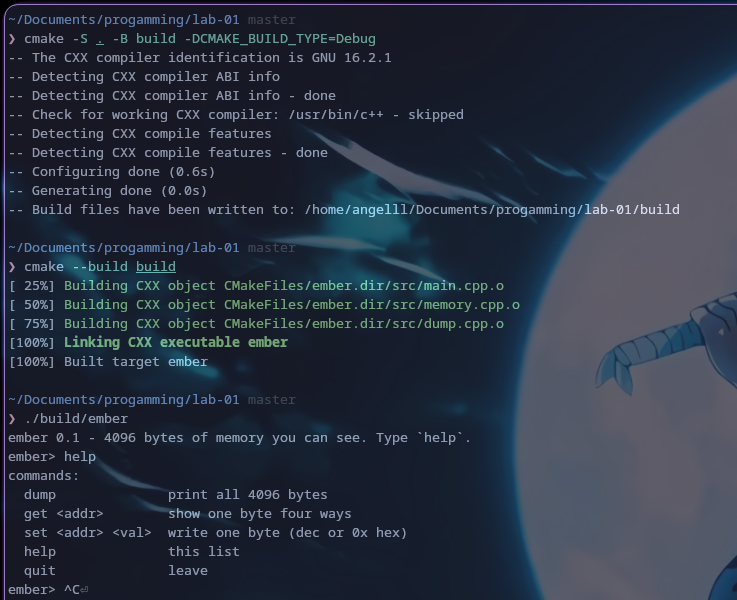
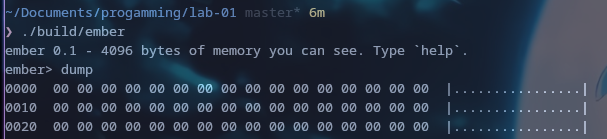
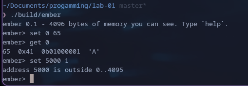
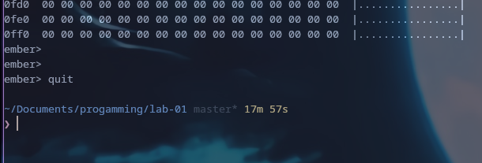
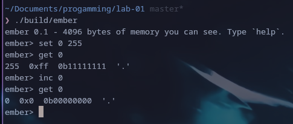
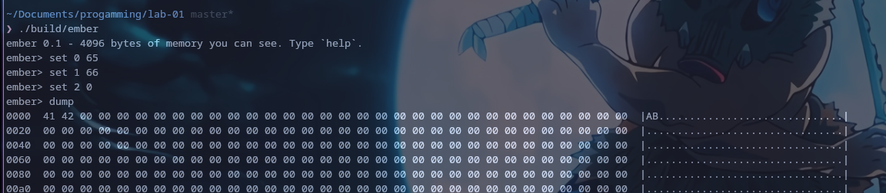
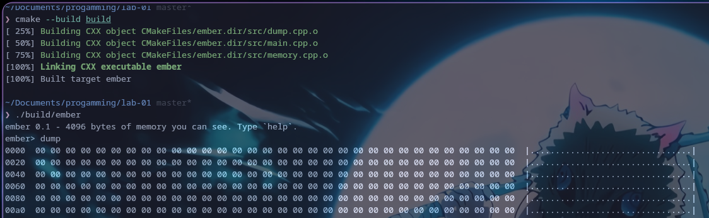
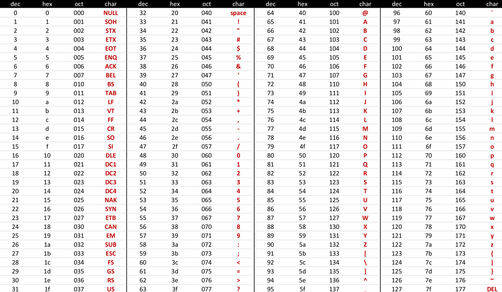

# `ember` — starter skeleton (Lab 1)
### Виконала: _Донець А.М._

## M1 - Збірка та запуск проєкту



## M2 - "Коробку" ініційовано нулями


## M3 - mem_set/mem_get працюють


## Quit працює


## M4 - зламайте навмисно й запишіть, що сталося

### 1 - Загортання байта


Байт "загорнувся". 

Для unsigned типу, значення при додатному переповненні зануляється, так як MIN=0. Для байту [0, 255], при додатному переповненні (255 + 1 = 256), отримуємо значення MIN, тобто 0.

Для signed типу, при переповненні маємо від'ємний знак максимальтного значення, так як межі [-X, X], тому _X + 1 = -X_

### 2 - Проженіть notes §3

"чому == 0.3 не спрацьовує" - через похибку представлення дробових чисел у двійковій системі.

### 3 - set 0 65 / set 1 66 / set 2 0, потім dump


Записано: 
- 65 = 'A'
- 66 = 'B'
- 0  = поза межами [0x20; 0x7E], виведено '.'

### 4 - Приберіть {} з Byte data[MEM_SIZE]{}

Прибрано {}, але виведення dump() все одно виводить нулі (00).



Тобто, що з {}, що без {}, виведення dump є нулями.

**Пояснення:** Сучасні операційні системи (Linux, macOS, Windows) у цілях безпеки при виділенні нових сторінок пам'яті для процесу фізично заповнюють їх нулями. Це зроблено для того, щоб ви не могли прочитати дані, що залишилися в пам'яті від інших програм. На даному ноутбуці встановлено Linux-систему, дана поведінка властива сучасним ядрам ОС.


## Досліди
### Код дослідів описано в ./excercises, скомпільована у ./excercises/bin

### 1 - sizeof — ширина на цій машині

Отримано типовий х64

```
~/Documents/progamming/lab-01 master*
❯ g++ ./excercises/1.cpp -o ./excercises/bin/1

~/Documents/progamming/lab-01 master*
❯ ./excercises/bin/1
1 4 4 8 8
1 2
```

### 2 - Переповнення: wrap vs UB

Виконалося переповнення максимального значення INT 

_2147483648 + 1 = -2147483648_

_Макссимальне значення + 1 = Мінімальне значення_

```
~/Documents/progamming/lab-01 master*
❯ g++ ./excercises/2.cpp -o ./excercises/bin/2

~/Documents/progamming/lab-01 master*
❯ ./excercises/bin/2
0
-2147483648
```

### 3 - Числа з рухомою комою

Отримано _0.1 + 0.2 != 0.3_ через бінарну неточність представлення чисел в комп'ютері.

0.1 = 0b 0001 1001 1001 1001 1001 ...

0.2 = 0b 0011 0011 0011 0011 0011 ...

0.3 = 0b 0100 1100 1100 1100 1100 ...

Але, через будь-яке округлення бітів в кінці, результат зсувається, тому при порівняні чисел з комою, можливі неточності. Й результат може бути:

0.1 + 0.2 = 0.300000000000....00001 != 0.3

```
~/Documents/progamming/lab-01 master*
❯ g++ ./excercises/3.cpp -o ./excercises/bin/3

~/Documents/progamming/lab-01 master*
❯ ./excercises/bin/3
0.3
false
```

### 4 - Символ — це теж число
Символи перетворюють через ASCII таблицю. 
```
~/Documents/progamming/lab-01 master*
❯ g++ ./excercises/4.cpp -o ./excercises/bin/4

~/Documents/progamming/lab-01 master*
❯ ./excercises/bin/4
65 65 65 A
B
2 2.5
```

